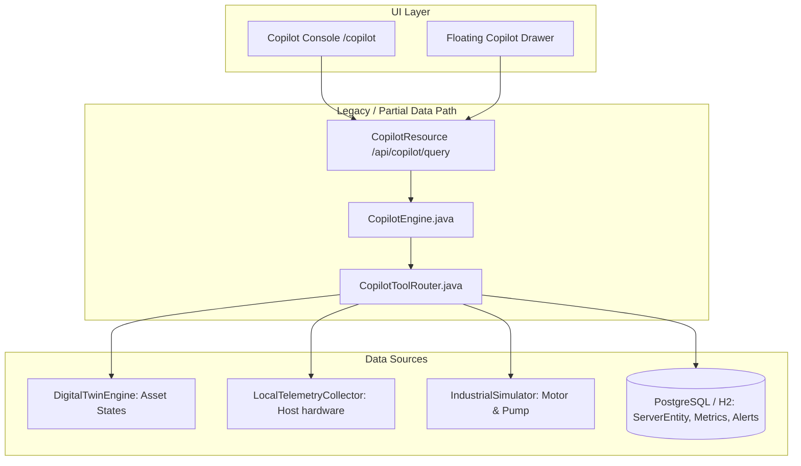

# COPILOT_AUDIT.md — IRISYN Copilot Data Flow & Architecture Audit

This audit evaluates the IRISYN Copilot AI implementation as mandated by the **DATA-FIRST REBUILD DIRECTIVE**.

---

## 1. Executive Summary & Root Cause Analysis

### Core Problem:
The earlier chatbot architecture mixed static text formatting, heuristic keyword matching, and partial API queries. In several cases, when an asset or metric identifier was slightly ambiguous or when time ranges were requested, response generators could output static fallback text or fail to perform deterministic time-series aggregation.

### Fundamental Principle:
$$\text{THE LLM IS NOT THE SOURCE OF TRUTH. IRISYN DATA IS THE SOURCE OF TRUTH.}$$

The LLM must **NEVER** guess or invent a system value, timestamp, health score, temperature, vibration, or alert count.

---

## 2. Current Architecture & Data Flow Breakdown

---

## 3. Detailed Audit of Available APIs & Data Sources

| Domain | Available Backend Component | Data Elements Accessible | Current Limitations |
|---|---|---|---|
| **Real Local Telemetry** | `LocalTelemetryCollector.java` | Real Host CPU (%), RAM (%), Disk (%), Temp (°C), Uptime (sec), Threads | Real-time sample available, but no deterministic time-range aggregator (SUM/AVG/MAX over 6h). |
| **Industrial Telemetry** | `IndustrialSimulator.java` | `MOTOR-001` & `PUMP-001` physics (RPM, Torque, Current, Voltage, Temp, Vibration) | Live parameters generated; lacks historical Z-Score calculation engine for LLM. |
| **Digital Twin Health** | `DigitalTwinEngine.java` | 0-100% composite health, transparent factor breakdown | Lacks entity/alias resolver (`"the motor"` $\rightarrow$ `MOTOR-001`). |
| **Data Quality & Transport** | `DataQualityEngine.java` / `SystemTelemetryResource` | Latency (ms), Freshness (ms), Data completeness (%) | Freshness status not automatically injected into every query response. |
| **Alerts & Incidents** | `AlertRepository.java` / `AlertResource.java` | `AlertEntity` severity, message, source, acknowledged status | Needs automatic incident timeline builder. |
| **Data Center Servers** | `ServerRepository.java` / `MetricRepository.java` | `dc-node-01..06` CPU, RAM, Temp, Disk | ServerStatus enum conversion bug fixed, but query routing needed alias mapping. |

---

## 4. Identified Failures & Root Causes

1. **Lack of Query Classification & Data Gate**:
   - General knowledge queries ("What is a Digital Twin?") were handled identically to live system data queries ("What is my CPU usage?").
   - **Fix**: Create `CopilotDataGate.java` to intercept and enforce MANDATORY tool data retrieval for system/data questions.

2. **No Entity Resolver (`CopilotEntityResolver.java`)**:
   - Queries like `"the motor"`, `"motor 1"`, `"node 3"`, `"server 3"`, `"my laptop"` failed to resolve to authoritative asset IDs (`MOTOR-001`, `dc-node-03`, `LAPTOP-001`).

3. **No Metric & Time Resolver (`CopilotMetricResolver.java` & `CopilotTimeResolver.java`)**:
   - Terms like `"thermal"`, `"amps"`, `"processor usage"`, `"last 6 hours"` were not deterministically parsed into standard metric keys and exact timestamps.

4. **Missing Deterministic Calculation Engine (`CopilotCalculationEngine.java`)**:
   - Mathematical functions (`SUM`, `AVERAGE`, `MIN`, `MAX`, `PERCENTAGE_CHANGE`, `RATE_OF_CHANGE`, `TREND`, `Z_SCORE`) were left to the LLM instead of being computed deterministically by Java code.

5. **Absence of Operational Data-Access Trace ("Data Used")**:
   - The user had no visual confirmation of exact asset IDs resolved, sample counts, freshness, and tool execution traces.

---

## 5. Rebuild Roadmap (21-Step Order as Mandated)

1. [x] Audit current Copilot architecture (`COPILOT_AUDIT.md`).
2. [ ] Build `CopilotDataGate.java` (Mandatory Data-First Interceptor).
3. [ ] Build `CopilotQueryRouter.java` (20 Intent Categories).
4. [ ] Build `CopilotEntityResolver.java` (Asset Alias Mapping & Clarification).
5. [ ] Build `CopilotMetricResolver.java` (Metric Alias Mapping).
6. [ ] Build `CopilotTimeResolver.java` (Natural Language Time to Timestamps).
7. [ ] Expand `CopilotToolRouter.java` (30+ Data Retrieval Methods).
8. [ ] Build `CopilotCalculationEngine.java` (SUM, AVG, MIN, MAX, TREND, Z-SCORE).
9. [ ] Build `CopilotResultValidator.java` (Freshness & Quality Verification).
10. [ ] Build Health & Factor Explainer (`Why did health drop?`).
11. [ ] Build "What Happened?" & Incident Timeline Engine.
12. [ ] Build Alert Explainer Engine.
13. [ ] Build System Status & Data Quality Engine.
14. [ ] Implement Data Source & Freshness Attribution (`REAL-TIME LOCAL` vs `SIMULATED`).
15. [ ] Implement Operational Data-Access Trace (`"Data Used"` drawer).
16. [ ] Implement Natural Language Analytics & Comparison Tables.
17. [ ] Connect UI Dashboard Navigation & Filter Actions.
18. [ ] Enforce Consequential Write-Action Confirmation Modal.
19. [ ] Implement Golden Test Suite & Automated Tests.
20. [ ] Refine Copilot Console & Floating Drawer UI.
21. [ ] Final Golden Test Verification.
