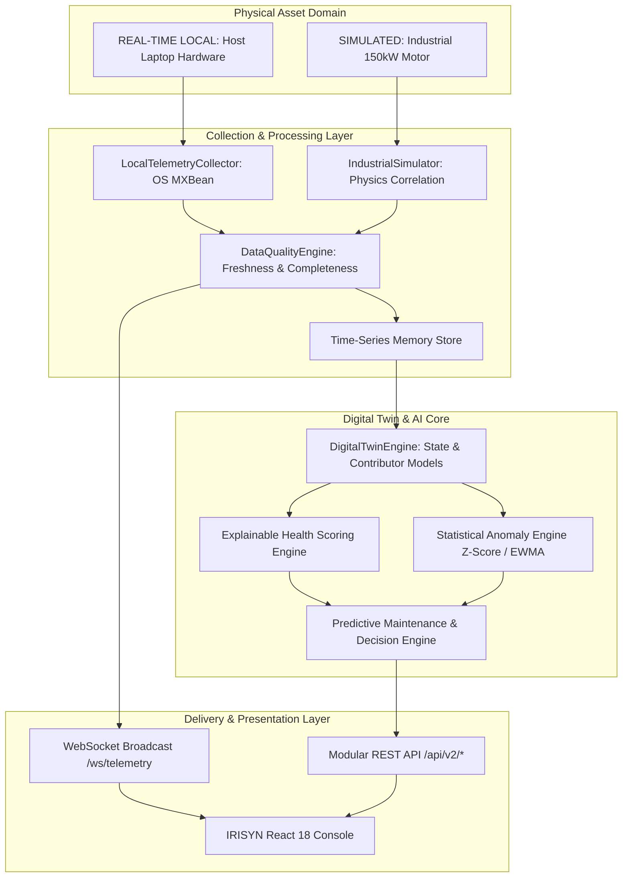

# IRISYN System Architecture & Engineering Blueprint

## Digital Twin Platform Architecture

---

## 1. Executive Summary & Core Philosophy

IRISYN is an **AI-Powered Digital Twin & Predictive Operations Platform** designed for real-time monitoring, state estimation, statistical anomaly detection, and predictive maintenance.

The architecture strictly delineates:
1. **REAL-TIME LOCAL DATA**: Live hardware telemetry captured directly from the physical host computer JVM (CPU, RAM, Disk, Temperature, OS, Uptime).
2. **SIMULATED INDUSTRIAL DATA**: Synthetic physical parameter stream for industrial machines (`MOTOR-001`, `PUMP-001`) with correlated physics (RPM, Torque, Current, Voltage, Temp, Vibration) and fault injection capabilities.
3. **TARGET / FUTURE ARCHITECTURE**: Industrial PLCs, Sensors, MQTT, OPC-UA Gateways, Red Hat Device Edge, OpenShift Container Platform, and OpenShift AI.

---

## 2. Logical Data Pipeline Architecture

---

## 3. Current Prototype vs Target Industrial Architecture

### Implemented Prototype Stack (Live)
- **Host Telemetry**: `LocalTelemetryCollector.java` reading real host CPU, RAM, Disk, and system uptime.
- **Simulator**: `IndustrialSimulator.java` simulating 3-Phase Motor physics with fault injection (Bearing Degradation, Thermal Overload, Electrical Fault).
- **Digital Twin Engine**: `DigitalTwinEngine.java` calculating transparent 0-100% health scores with factor breakdowns.
- **Backend API**: Quarkus 3.13 Java 17 REST & WebSockets `/ws/telemetry`.
- **Frontend**: React 18 + Vite + Tailwind CSS + Recharts dashboard.

### Target Industrial Architecture (Red Hat & OpenShift Blueprint)
- **Edge Layer**: Machine PLCs $\rightarrow$ Modbus / OPC-UA $\rightarrow$ Red Hat Device Edge (RHEL for Edge).
- **Transport**: Red Hat AMQ / Apache Kafka Event Streaming.
- **Cluster Platform**: Red Hat OpenShift Container Platform.
- **AI/ML MLOps Platform**: Red Hat OpenShift AI (Kubeflow / ModelMesh for continuous anomaly inference).
- **Enterprise Dashboard**: IRISYN Cloud/Edge Portal.

---

## 4. Transparent Data Attribution Standard

| Data Source Tag | Meaning & Scope | Visual Indicator |
|---|---|---|
| `REAL-TIME LOCAL` | Actual live telemetry measured from host computer. | Green Badge |
| `SIMULATED` | Synthetic asset metrics generated by physics-correlated simulator. | Purple Badge |
| `TARGET / FUTURE` | Planned industrial machine or cloud integration blueprint. | Gray Badge |
