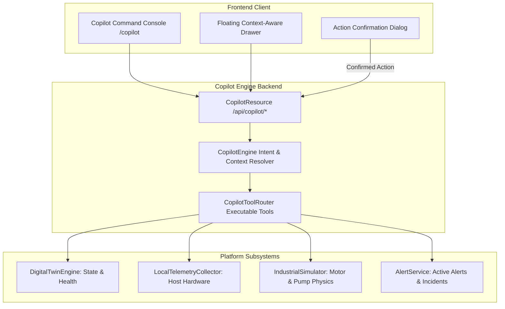

# IRISYN Copilot Technical Specification & AI Architecture

## Digital Twin Engineering Copilot

---

## 1. Executive Summary & Purpose

**IRISYN Copilot** is a context-aware Digital Twin AI assistant designed for real-time state estimation, telemetry diagnostics, root-cause analysis, and operational decision support.

Unlike generic chatbots, IRISYN Copilot:
- Operates on **live platform state** via controlled backend tool interfaces (`CopilotToolRouter`).
- Distinguishes **`REAL-TIME LOCAL`** laptop telemetry from **`SIMULATED`** industrial assets (`MOTOR-001`) and **`TARGET / FUTURE`** cloud blueprints.
- Employs an **Action Confirmation Safety Protocol** for consequential write operations.
- Structurally separates **`ANSWER`**, **`EVIDENCE`**, **`RISK`**, **`RECOMMENDATION`**, and **`DATA SOURCES USED`**.

---

## 2. Technical Architecture & Tool Flow

---

## 3. Tool Function Inventory (`CopilotToolRouter`)

| Tool Function | Description | Source Tag |
|---|---|---|
| `getAssets()` | Returns all registered digital asset twin instances. | All Sources |
| `getAsset(id)` | Retrieves detailed twin state, health score, and metric breakdown. | Live State |
| `getCriticalOrUnhealthyAssets()` | Filters assets with health score $<80\%$ or active warning/critical status. | Health Engine |
| `getSystemHealth()` | Aggregates overall platform health score and status counts. | System |
| `getSimulationState()` | Retrieves pause status, speed multiplier (1x-50x), and active scenario. | Simulator |
| `getDataQuality()` | Returns telemetry freshness (ms), completeness (%), and latency. | Transport |
| `executeAction(action, target, scenario)` | Executes confirmed scenario injection or reset operation. | Simulation Control |

---

## 4. Consequential Action Confirmation Protocol

To prevent accidental modification of simulation parameters, write operations require explicit confirmation:

1. **User Request**: `"Inject bearing fault into MOTOR-001"`
2. **Intent Engine**: Identifies write operation. Returns `requiresActionConfirmation: true` with action payload.
3. **UI Confirmation Banner**: Displays:
   - `ACTION`: `INJECT_FAULT`
   - `TARGET`: `MOTOR-001`
   - `MODE`: `SIMULATION`
   - `SCENARIO`: `BEARING_DEGRADATION`
4. **Execution**: Triggered only upon user clicking **`[Confirm Execution]`**.

---

## 5. Future Capability Roadmap (Target Architecture)

- **Natural Language SQL & Time-Series Querying**: Directly querying historical metric databases via SQL-over-natural-language.
- **Engineering RAG (Retrieval-Augmented Generation)**: Vector search over PDF maintenance manuals, equipment datasheets, and SOPs.
- **Red Hat OpenShift AI Integration**: Multi-modal anomaly model inference via OpenShift AI MLOps pipelines.
